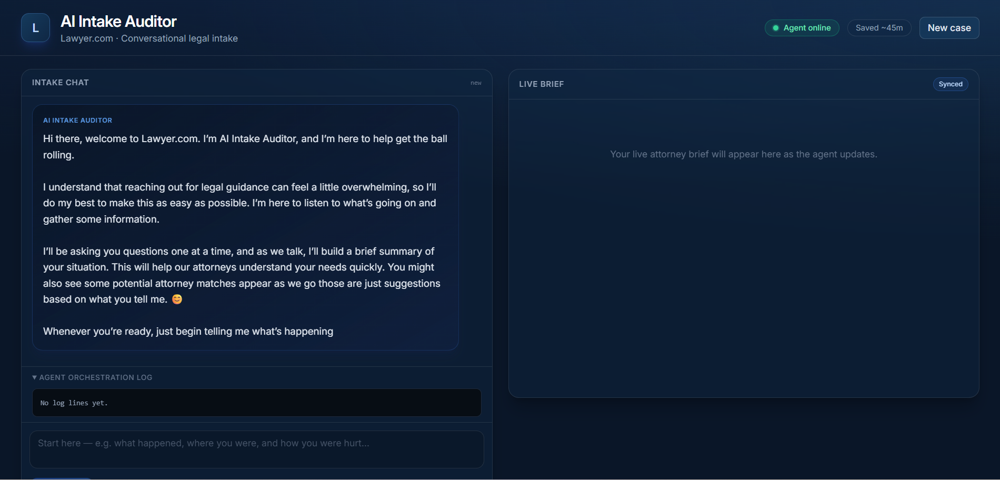
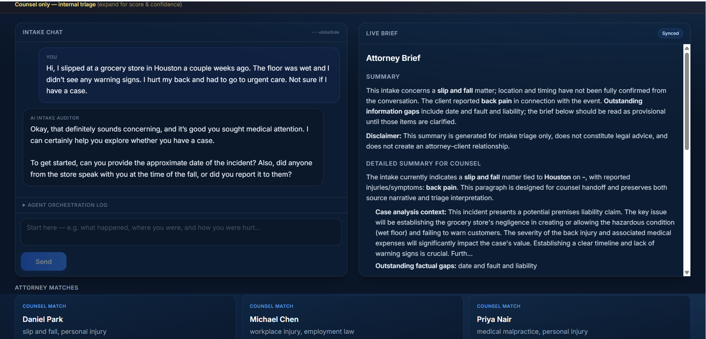
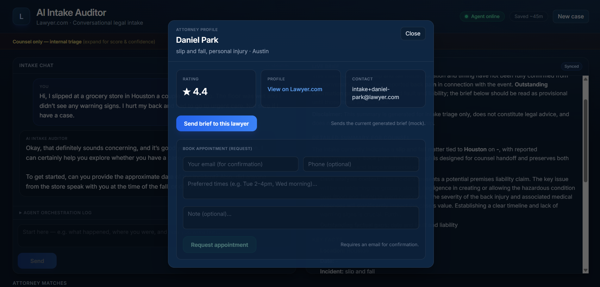

# AI Intake Auditor

AI Intake Auditor is an interview-style demo: a **multi-turn chat** on the left and a **live Markdown attorney brief** on the right. Orchestration is **async Python**: **scribe** → **parallel** (auditor + matcher + researcher) → **compose assistant reply**. (We avoid `LangGraph.ainvoke` here because its dict merge was **dropping accumulated `logs`** from earlier steps.)

> Folder on disk: `AI_Auditor/`.

## Screenshots







## Features

- **Stateful conversation** with server-side sessions (`session_id`)
- **SCRIBE**: incremental fact extraction from the full transcript
- **AUDITOR**: assumptions, risk, and a **case readiness score on a 1-10 scale**
- **MATCHER** + **RECOMMENDER** path: matcher ranks attorneys by fit; recommender-facing card data (rating/profile/contact) powers attorney actions in UI
- **RESEARCHER** (simulated plausibility + reasoning logs) in **parallel**
- **Gaps helper** (`effective_missing_fields`): summary/replies use **fact-based** gaps so “complete” is not shown while fields are still empty
- **FastAPI**: `POST /chat` (primary), `POST /analyze` (one-shot), and a **single-page web UI** at `/`

## Project structure

```text
AI_Auditor/
├── app/
│   ├── main.py              # FastAPI: /health, /chat, /analyze
│   ├── controller.py        # handle_message: append user, run graph, compose reply
│   ├── graph.py             # Async pipeline: scribe → parallel → compose reply
│   ├── state.py             # ConversationalState schema
│   ├── llm.py               # Gemini chat helper (text + JSON)
│   ├── agents/
│   │   ├── scribe.py
│   │   ├── auditor.py
│   │   ├── matcher.py
│   │   ├── researcher.py
│   ├── utils/
│   │   ├── prompts.py
│   │   ├── formatter.py   # Markdown brief (right panel)
│   │   ├── logger.py
├── ui/
│   ├── index.html           # Web UI shell
│   ├── static/
│   │   ├── app.css
│   │   └── app.js
├── data/
│   ├── lawyers.json
├── tests/                   # pytest unit tests
├── requirements.txt
├── requirements-dev.txt     # pytest, ruff
├── pyproject.toml           # ruff + pytest config
├── README.md
```

## Conversational state (persistent)

```json
{
  "conversation": [{ "role": "user|assistant", "content": "..." }],
  "extracted_facts": {
    "location": "",
    "date": "",
    "incident_type": "",
    "injuries": ""
  },
  "missing_fields": [],
  "assumptions": [],
  "risk_analysis": "",
  "case_score": 0.0,
  "lawyer_matches": [],
  "next_question": "",
  "confidence_score": 0.0,
  "logs": []
}
```

## Setup

1. Create a virtual environment and install dependencies:

```bash
python -m venv .venv
.venv\Scripts\activate
pip install -r requirements.txt
```

2. Configure Gemini (optional; heuristics apply if the key is missing or the API errors):

   - Copy `.env.example` to `.env` and set `GEMINI_API_KEY`.
   - Optional: `GEMINI_MODEL`, `GEMINI_TEMPERATURE`.

3. Run the API (and built-in web UI):

```bash
python -m uvicorn app.main:app --reload --host 127.0.0.1 --port 8000
```

4. Open:

   - **App:** <http://127.0.0.1:8000/>
   - API docs: <http://127.0.0.1:8000/docs>

## Deploy on Railway

The repo includes a **`Dockerfile`**, **`railway.toml`** (Docker build + `/health` check), and **`.dockerignore`**.

### One-time setup

1. Create a [Railway](https://railway.app/) account and install the [Railway CLI](https://docs.railway.app/develop/cli) (optional; the web UI is enough).
2. **New project** → **Deploy from GitHub repo** → select this repository.
3. Railway will detect the Dockerfile and build the image.

### Environment variables

In the Railway service → **Variables**, add at least:

| Variable | Required | Notes |
|----------|----------|--------|
| `GEMINI_API_KEY` | Yes (for real LLM) | Same as local `.env` |
| `GEMINI_MODEL` | No | Optional override |
| `GEMINI_TEMPERATURE` | No | Optional |

Railway injects **`PORT`** automatically; the container listens on `0.0.0.0` using that port.

### Deploy flow

- **GitHub:** Push to `main` (or your connected branch) → Railway rebuilds and redeploys.
- **CLI (optional):** `railway login` → `railway link` in the project folder → `railway up` for deploys.

### After deploy

- Open the **public URL** Railway assigns (Settings → Networking → generate domain if needed).
- Health: `https://<your-domain>/health` should return JSON.

### Local Docker check (optional)

```bash
docker build -t ai-intake-auditor .
docker run --rm -p 8000:8000 -e GEMINI_API_KEY=your_key -e PORT=8000 ai-intake-auditor
```

Then visit <http://127.0.0.1:8000/>.

**Note:** Chat sessions are stored **in memory** on one instance. For a single Railway instance this is fine for demos; scale-out would need shared storage (e.g. Redis).

## API

### `POST /chat` (primary)

Request:

```json
{
  "message": "I slipped in a Dallas store yesterday and hurt my wrist.",
  "session_id": null
}
```

Response:

```json
{
  "reply": "...",
  "brief": "## Attorney Brief\\n...",
  "logs": ["..."],
  "session_id": "uuid-returned-by-server"
}
```

Send the same `session_id` on subsequent turns to continue the conversation.

### `POST /analyze` (one-shot)

Single user message, full pipeline, Markdown brief (no session).

## Development

Install dev tools:

```bash
pip install -r requirements-dev.txt
```

Run tests:

```bash
python -m pytest
```

Lint with Ruff:

```bash
python -m ruff check app tests
```

Optional format:

```bash
python -m ruff format app tests
```

## Notes

- **RESEARCHER** is simulated (no browser automation).
- Assistant reply asks concise clarifying follow-ups based on `missing_fields` (can include multiple when useful).
- `compose_assistant_reply` runs **after** `run_pipeline` so the chat reply and assistant turn are always present in the returned state.
